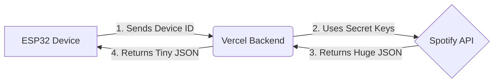

# Spotify IoT - Setup Tool & Backend

This repository hosts the **Serverless Backend** and **Web Interface** for the Spotify IoT Display project.

It acts as a secure "Backend-for-Frontend" (BFF) bridge between the low-power ESP32 hardware and the complex Spotify Web API.

**Live Tool:** [https://spotify-setup-tool.vercel.app](https://spotify-setup-tool.vercel.app)

---

## Why Do We Need This Backend?

You might ask: _"Why doesn't the ESP32 connect directly to Spotify?"_

Connecting a microcontroller directly to Spotify's API presents three major challenges:

1.  **Authentication Complexity:** Spotify uses **OAuth2**, which requires complex token exchanges (Access Token, Refresh Token) that are difficult to manage reliably on embedded devices.
2.  **Heavy Data Processing:** A simple request to Spotify returns a massive JSON object (often 10KB+). Parsing this on an ESP32 can cause memory fragmentation and crashes.
3.  **Security:** Hardcoding your Spotify `Client ID` and `Client Secret` into the firmware is a security risk. If you share your code, you share your secrets.

### The Solution: A "Middleman" Server

This backend does the heavy lifting so your hardware doesn't have to.

---

_For the full project documentation and firmware setup, please refer to the root `README.md`._
